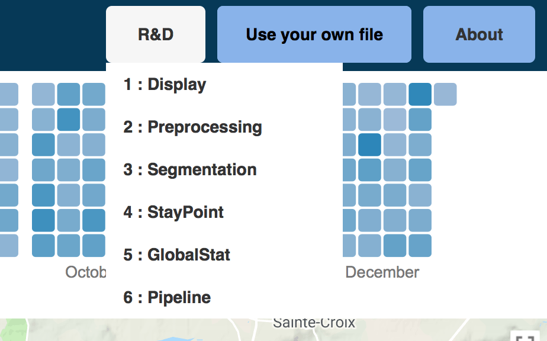
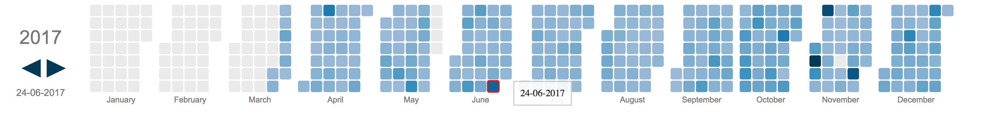

# GPSFlow

This project allows you to download, process and visualize your GPS data from your Google Location History.

Authors : <a href="https://github.com/MathReynaud"> Mathilde Reynaud </a> |
				<a href="https://github.com/thalkz"> Roland Lamidieu</a> |
				<a href="https://github.com/alexandrospopov"> Alexandre Popov </a> |
				<a href="https://github.com/FrancoisPgm"> François Paugam </a> |
				<a href="https://github.com/Skan0394"> Skander Malouche </a>

If you do not wish to download your data, or if you do not have any, you can still go to the [visualization](https://amigocap.github.io/GPSFlow/), there is some test data. You can see the treatment that has been done to the data by clicking on "raw data".

<table border="0">
  <tr>
    <td>
      
    </td>
  </tr>
</table>

## Visualization

### Use your data

<table border="0">
  <tr>
    <td>
      
    </td>
  </tr>
</table>

This visualization allows you to download your own data, but first you need to process it (see below). Once it is done, juste click on "Use your own file". 
If you are interested on the process of the data, you can see our work and algorithms explained in details in "R&D".

### Navigate

<table border="0">
  <tr>
    <td>
      
    </td>
  </tr>
</table>

The navigation bar allows you to navigate throw the years by clicking on the arrows. To display one day on the map, simply click on the heatmap. The day selected will be circled in red, and the data displayed on the left (here it was the 26-06-2017)	

## How to execute gpsflow

1. Download the project

```
git clone https://github.com/AmigoCap/GPSFlow
```

2. Download your Google Takout Location History [here](https://takeout.google.com/settings/takeout)

- Deselect everything but 'Location History' and click download. 
- Google may ask for your password and you will download a `.zip`. 
- Unzipp it and find the `.json` file, which contains all the GPS data collected by Google Maps.

4. Rename it to `takout.json` and place it into the `pipeline/build-<YOUR_OS>/dist/` folder of the project

5. Using your terminal, navigate to the `pipeline/build-<YOUR_OS>/dist/` folder and run the following command :

```
./gpsflow takout.json
```

6. Your GPS data will be parsed, filtered and analysed. It can take a while (up to 15min). Let it run until everything is done.

7. Once the programm is finished, if everything went well, you should have a file called `output.json` inside the `dist/` folder.

8. Use the [visualization](https://amigocap.github.io/GPSFlow/) tool to display the output in your navigator.

## How to recompile gpsflow from source

1. Install pyinstaller

```
pip install pyinstaller
```

2. cd into the `pipeline/build-<YOUR_OS>/` folder

3. delete `dist/`,  `build/` and `gpsflow.spec`

4. From inside `build-<YOUR_OS>/`, run the following command

```
pyinstaller --onefile --additional-hooks-dir=hooks ../src/gpsflow.py
```

5. Once finished, the compiled executable is `gpsflow` inside the `dist/` folder

## How to run gpsflow using python

1. Download the project

```
git clone https://github.com/AmigoCap/GPSFlow
```

2. Install all modules listed in `pipeline/requirements.txt`

3. Download your Google Takout Location History [here](https://takeout.google.com/settings/takeout)

- Deselect everything but 'Location History' and click download. 
- Google may ask for your password and you will download a `.zip`. 
- Unzipp it and find the `.json` file, which contains all the GPS data collected by Google Maps.

4. Rename it to `takout.json` and place it into the `pipeline/src/` folder of the project

5. Using your terminal, navigate to the `pipeline/src/` folder and run the following command :

```
python main.py takout.json
```

6. Your GPS data will be parsed, filtered and analysed. It can take a while (up to 15min). Let it run until everything is done.

7. Once the programm is finished, if everything went well, you should have a file called `output.json` inside the `src/` folder.

8. Use the [visualization](https://amigocap.github.io/GPSFlow/) tool to display the output in your navigator.
